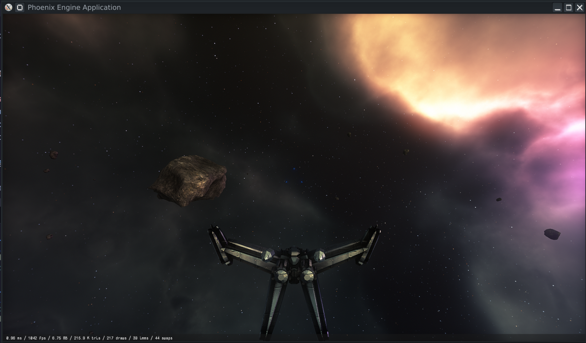

# Limit Theory

Limit Theory is a now-cancelled open world space simulation game.

This repository is the game (not engine) code for the second generation of LT's development, when all work was migrated to C and Lua. For the older, C++/LTSL Limit Theory, see https://github.com/JoshParnell/ltheory-old.


# Prerequisites

To build Limit Theory, you'll need a few standard developer tools. All of them are available to download for free.

- Python: https://www.python.org/downloads/
- Git: https://git-scm.com/downloads
- Git LFS: https://git-lfs.github.com/
- Visual Studio Community: https://visualstudio.microsoft.com/vs/ (Windows only)
- CMake: https://cmake.org/download/

**Linux users:** You'll also need these system libraries for the engine to run:
```bash
sudo apt install libglu1-mesa-dev libglew-dev libsdl2-dev libfreetype6-dev liblz4-dev libluajit-5.1-dev libbullet-dev
```

# Building

With the above prerequisites installed, open a **Git Bash terminal**.

## Checking out the Repository

First, use `cd` to change directories to the place where you want to download LT.
- `cd ~/Desktop/<path where you want to put the LT source>`

Before doing any other `git` commands, make sure LFS is installed:
- `git lfs install`

You should see `Git LFS initialized` or a similar message. **Important**: if you forget to install and initialize Git LFS, most of the resources will probably be broken, and the whole process will likely fail in strange and mysterious ways. This is a common gotcha with projects that use LFS. Make sure you do the above step!

Now, you can download the repository:

- `git clone --recursive https://github.com/JoshParnell/ltheory.git ltheory`

## Compiling

Once you have the repository, the build process proceeds in two steps (as with other CMake builds): generating the build files, and then building. There is a Python script `configure.py` at the top level of the repository to help you do this easily.

From a terminal in the directory of the checked-out repository, run

- `python configure.py`

This runs CMake to generate the build files. Then, to compile,

- `python configure.py build`

## Running a Lua App

If the compilation is successful, you now have `bin/lt64.exe`, which is the main executable. This program launches a Lua script. The intention was for Limit Theory (and all mods) to be broken into many Lua scripts, which would then implement the gameplay, using script functions exposed by the underlying engine.

To launch a Lua script, you can again use the python helper:
- `python configure.py run`

To run the default script ('LTheory'), or
- `python configure.py run <script_name_without_extension>`

to run a specific script. All top-level scripts are in the `script/App` directory.

# Resurrection Progress & How to Run on Linux

This repository has been resurrected and is now running on Linux with modernized GLSL 130 shaders (upgraded from the original GLSL 120), a refactored G-buffer, fog re-enabled, ambient lighting added, and the full deferred rendering pipeline operational. The main game app (`LTheory`) boots, generates a world, spawns ships, and runs the full game loop (rendering, physics, AI) without crashing. (Note: shaders are still `#version 130` — the planned bump to GLSL 330 has **not** yet been done; see "What Was Fixed" and "Recommended Roadmap".)

## Prerequisites for Linux

In addition to the standard prerequisites above, you need these system libraries:

- `libglu1-mesa-dev` — OpenGL Utility Library (GLU) bindings; required by CMake for some OpenGL functions.
- `libglew-dev` — GL Extension Wrangler; provides modern OpenGL function pointers and extension loading.
- `libsdl2-dev` — Simple DirectMedia Layer; handles windows, input devices, audio, and timing.
- `libfreetype6-dev` — FreeType font rendering library; used for text display in the UI.
- `liblz4-dev` — LZ4 compression library; used by the engine to compress assets at runtime.
- `libluajit-5.1-dev` — LuaJIT 5.1 interpreter and FFI bindings; the scripting language Limit Theory uses.
- `libbullet-dev` — Bullet physics engine (system version 3.x); handles rigid body dynamics, collisions, etc.

Install them with:
```bash
sudo apt install libglu1-mesa-dev libglew-dev libsdl2-dev libfreetype6-dev liblz4-dev libluajit-5.1-dev libbullet-dev
```

## Building on Linux

The build system is primarily configured for Windows, but has basic Linux support in `CMakeLists.txt`. Run:
```bash
python configure.py
python configure.py build
```

This will produce the engine library and executable in `bin/`.

## Running on Linux

The engine no longer requires `LD_LIBRARY_PATH`. The simplest way to launch is via the
bundled launcher, which `cd`s to the project root and sets `LD_LIBRARY_PATH` as a safety
net:

```bash
cd <root directory where the ltheory-test code is>
./run.sh LTheory
```

For a one-command setup (install dependencies, configure, build), use:

```bash
./bootstrap.sh
./run.sh LTheory
```

You can also run the binary directly from the project root without any environment
variables — `$ORIGIN`-based rpath resolves the shared libraries automatically:

```bash
cd <project root>
./bin/lt64r LTheory
```

## Example of the Entire Process on Linux

Open a terminal and run:

```bash
cd ~/Documents/Code_Projects/ltheory-test
./run.sh LTheory
```



Replace the path with your actual project location. The `lt64r` executable is the Linux version (the `.exe` files are Windows-only).

## Playing & Interacting

- **Fly:** mouse / WASD-style ship controls (see `script/Game/Controls/ShipBindings.lua`).
- **Fire:** hold **left mouse** (or right gamepad trigger). Turrets auto-aim at your crosshair.
- **Lock target:** press **`T`** to lock the entity nearest your crosshair; **`G`** clears. A colored health bar (`cur / max`) is drawn over the locked target.
- **Destroy things:** shoot or ram asteroids. A destroyed asteroid shatters into 2–4 smaller asteroids (which also take damage and cascade), plus an explosion burst. Dead entities are automatically removed from the world.
- **Debug damage:** set `Config.debug.damageLog = true` in `script/Config.App.lua`, then run `./run.sh LTheory 2>&1 | grep DAMAGE` to watch every hit in the console.
- To see target brackets, set `Config.ui.showTrackers = true` in `script/Config.Local.lua`.

## Learning the Engine / Building Scenes

The gameplay is pure Lua in `script/`. A few starting points:

- **Spawn a field of asteroids** (in `script/App/LTheory.lua:generate()` or any app):
  ```lua
  self.system:spawnAsteroidField(2000, 20)   -- count, oreCount
  ```
  Or one asteroid manually:
  ```lua
  local a = Entities.Asteroid(seed, scale)
  a:setPos(Vec3f(x, y, z))
  self.system:addChild(a)                     -- addChild = put it in the live world
  ```
- **Make something destructible** (pattern in `script/Game/Entities/Asteroid.lua`):
  ```lua
  self:addHealth(maxHp, 0)                    -- 0 = no regen
  self:register(Event.Destroyed, function (self, source)
    -- spawn debris / fragments / explosions here
  end)
  ```
  Damage is applied via `entity:damage(amount, source)`; at 0 health it fires `Event.Destroyed`.
- **Shaders** live in `res/shader/` (vertex + fragment `.glsl`), loaded at runtime via `Cache.Shader(vs, fs)`. The engine prepends `#version 130` and runs a custom preprocessor (`#include`, `#autovar`). Draw UI with `UI.DrawEx.*` (`Rect`, `TextAdditive`, `Tri`, `Arrow`, `Wedge`, ...). See `AGENTS.md` → "Gameplay Systems" and "Shader Portability Rules" for the full conventions.
- **Documentation for contributors:** see `AGENTS.md` — it tracks build state, the LuaJIT/Bullet notes, and the gameplay-system internals (asteroids, damage, targeting, ramming, entity GC).

## Recommended Roadmap

Based on current state and next steps:

1. **Bump GLSL version to 330** — **NOT done yet.** `Shader.cpp` still prepends `#version 130`, and the G-buffer uses `out vec4 fragData0/1/2` (not `layout(location = N)`). All shaders were modernized GLSL 120→130 and the 330 bump is the next step (see "What We Want to Try to Update").
2. **Replace corrupted texture assets** — Nearly all textures in `res/` are corrupted placeholder files. Replace with real assets or procedural generation. The engine already handles missing textures gracefully with magenta fallbacks.
3. **Clean up `common.glsl` dead code** — `HIGHQ` is always force-defined, making `LOWQ` branches dead code. Either remove the `#ifdef HIGHQ` guards entirely (always use the HIGHQ path) or add a runtime toggle. This eliminates confusing GLSL warnings about unused uniforms.
4. **Extend the engine** for Freelancer-style 3D space environments — procedural nebulae, dust clouds, sector transitions, and more. The rendering pipeline is solid; this would be pure content creation.
5. **Update documentation** — Add proper license file (MIT or similar), update `AGENTS.md` with current state, and create a CONTRIBUTING guide for anyone wanting to help extend the engine.

## What Was Fixed to Get It Running

- **Bullet Physics ABI mismatch**: The engine was compiling with Bullet 2.87 headers but linking against system Bullet 3.24, causing heap corruption on every physics object allocation. This was fixed by removing the old bullet include path and using system Bullet 3 headers.
- **Texture resilience**: Nearly all texture assets are corrupted placeholder files. The engine now creates magenta fallback textures instead of crashing with `Fatal()`.
- **Shader fixes**: Removed unused `#autovar` declarations that were causing warnings, refactored the G-buffer to use `out vec4` output variables instead of deprecated `gl_FragData[]`, and modernized shaders from GLSL 120 to GLSL 130 syntax. (The engine still hardcodes `#version 130` in `Shader.cpp`; the planned bump to GLSL 330 is **not done**.)
- **G-buffer refactor**: Changed the deferred rendering pipeline to use explicit `out vec4 fragData0/1/2` variables instead of deprecated `gl_FragData[]`.
- **Fog re-enabled**: The composite shader now properly applies fog effects (was previously disabled).
- **Ambient lighting added**: Added ambient light contribution to improve overall scene brightness and realism.
- **ui.glsl fix**: Updated the UI vertex shader to use explicit `mProj`/`mView` matrices instead of deprecated built-ins (`gl_ProjectionMatrix`, `gl_ModelViewMatrix`).
- **LuaJIT runtime errors resolved**: A prior refactor broke `Game.SocketType`/`Game.Socket` (introducing a `SocketType.LTheory_SocketType` `nil` access and an undefined `GameSocket` global). Fixed by using the module tables directly. Also renamed `Game/SocketType.lua` → `Game/SocketKind.lua` and `Game/Socket.lua` → `Game/SocketObj.lua` so `Namespace.LoadInline('Game')` no longer shadows the `PHX.FFI.SocketType`/`PHX.FFI.Socket` globals (the "shadowing" warnings).
- **LuaJIT 2.1 (not 2.0.1)**: On Linux the engine links the system `luajit-5.1` package, which is **LuaJIT 2.1.1761786044** (OpenResty-maintained branch, Lua 5.1 ABI). The bundled `lua51.dll`/headers under `libphx/ext` are Windows-only (and are 2.1.0-beta3). No Linux LuaJIT `.so` is bundled. If 2.0.1 was used originally it was a Windows-only binary; nothing in the current tree pins 2.0.1. The `dump2.lua` version assertion was disabled as a stopgap. See `AGENTS.md` → "LuaJIT Status" for the reproducible-build note.
- **No more `LD_LIBRARY_PATH`**: Added `$ORIGIN`-based rpath to `lt64r` and `libphx64r.so` (CMake `BUILD_RPATH`/`INSTALL_RPATH`), and made `ffi.load` resolve `libphx64.so` by absolute path from the script location. Also patched the bundled `libfmod.so` executable-stack flag (`GNU_STACK` `RWE` → `RW`) that modern kernels reject on `dlopen`. Added `run.sh` (launcher) and `bootstrap.sh` (one-command setup). Bumped `cmake_minimum_required` to 3.16 and C++ standard to C++17.
- **Build script fixes**: `configure.py` + CMake now produce a relocatable Linux build; FMOD symlinks and `libphx64.so` symlink are already tracked in git.
- **Mesh degenerate-geometry warnings fixed**: Added `Shape:cleanup()` (welds coincident vertices and drops degenerate/bowtie polys) and call it from `Shape:finalize()`. This eliminates the `Bad normal at poly` and `BSP Incoming Mesh Error: Vertex Position Degenerate` warnings at their source. Ships build and display cleanly.
- **Asteroids are now destructible**: Added health + an `Event.Destroyed` handler (`fragment`) in `script/Game/Entities/Asteroid.lua` that breaks a destroyed asteroid into 2–4 smaller asteroids (cascading) plus an explosion/dust burst. Previously asteroids had no health, so shooting them did nothing.
- **Entity GC added**: `System:sweepDestroyed` (`script/Game/Entities/System.lua`) removes destroyed/deleted entities each frame, pulling their rigid bodies out of physics — so dead asteroids no longer linger in the world (and you can't crash into a corpse).
- **Ramming damage**: `System:handleRamming` deals symmetric collision damage based on relative impact speed, so ramming an asteroid can destroy it too.
- **Targeting / lock fixed**: `HUD:drawTargets` now always computes the lock candidate (it was previously gated behind `Config.ui.showTrackers`, which is `false` in `Config.Local.lua`, so pressing `T` did nothing). `HUD:drawLock` draws a health bar over the locked target and clears the lock when the target dies.
- **UI triangle shader bug fixed**: `res/shader/fragment/ui/triangle.glsl` wrote to read-only `uniform` variables and mixed `vec3`/`vec2` math, causing a GLSL compile error that crashed the game whenever a UI triangle was drawn (e.g. the lock arrow). Now fixed; pressing `T` no longer aborts.
- **Balance**: `pulseDamage` raised (5 → 40) and asteroid health lowered (`scale*10`) so a few shots actually destroy a rock. `RigidBody_SetLinearVelocity` added so fragments get an outward kick.
- **Console damage log**: set `Config.debug.damageLog = true` in `script/Config.App.lua` to print every hit as `[DAMAGE] entity#id took X ...`.

## What We Want to Try to Update/Add

- **Bump GLSL version to 330** — The engine currently uses `#version 130`. GLSL 330 gives proper `in`/`out` support and better compiler support on modern GPUs. All shaders are now GLSL 130+ compatible, so this should be straightforward.
- **Replace corrupted texture assets** — Nearly all textures in `res/` are corrupted 130-byte placeholder files (the original asset archive was incomplete). Replace with real assets or procedural generation. The engine already handles missing textures gracefully with magenta fallbacks.
- **Clean up `common.glsl` dead code** — `HIGHQ` is always force-defined, making `LOWQ` branches dead code. Either remove the `#ifdef HIGHQ` guards entirely (always use the HIGHQ path) or add a runtime toggle. This eliminates confusing GLSL warnings about unused uniforms.
- **Complete GLSL 130 cleanup** — Replace remaining ~55 `texture2D` calls and `gl_FragColor` usage in filter/UI/compute shaders (deprecated but functional in GLSL 130).
- No sound or music is working
- Modify the control scheme a little to allow freelancer style controls and controller use
- There is a 'dock' option flying close to the station, would like to actually dock and see what happens
- Figure out how to add NPC ships 
- Figure out how to blow up things (ie: asteriods)
- Need to get some documentation for the engine so we can learn how to use it
- Investigate the 'old Limit Theory' code to see if those examples can be converted to this code
